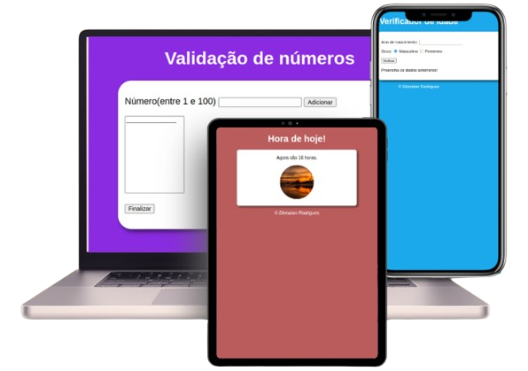

# Cursos de javascript
 
## JavaScript básico

   

 

    Curso de JavaScript básico desenvolvido pelo professor Gustavo Guanabara no  <a href="https://www.cursoemvideo.com/" target="_blank" rel="external">Curso em Vídeo</a>. Densenvolvi projetos pequenos como nos exemplificados na imagem acima com o objetivo de compreender a manipulação do DOM em javascript.

## Fundamentos do javascript

   

 

    Curso de JavaScript básico desenvolvido pela  <a href="https://voitto.com.br/" target="_blank" rel="external">Voitto</a>. Densenvolvi desafios ao longo de seus cinco módulos que foram desde o conhecimento de variáveis, conficionais, loops de repetição e orientação a objetos até a manipulação de DOM onde desenvolvi dois projetos pequenos com validação de formulários sendo eles exemplificados na imagem acima.

